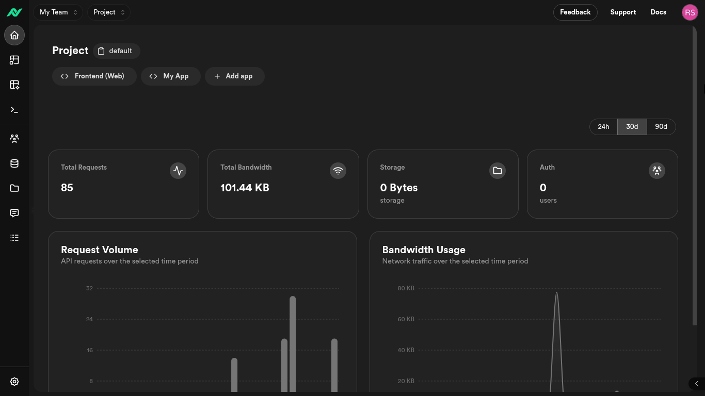

# Nuvix Console: Admin Dashboard

The Nuvix Console is the central hub for managing your Nuvix backend. This admin dashboard offers streamlined control over Nuvix’s core services, including authentication, data storage, messaging, and REST API configurations.



## 🌟 About Nuvix Console

The Console simplifies backend management with an intuitive interface designed for developers and operations teams. Key features include:

- 🔐 **Built-in Authentication** - User management, OAuth, and secure session handling
- 💾 **Storage Solutions** - File storage, database management, and data APIs  
- 📧 **Messaging Services** - Email, push notifications, and SMS capabilities
- 🚀 **Database-to-REST APIs** - Automatically generate REST APIs from your database schema
- ⚡ **Modern Architecture** - Built with performance, scalability, and developer experience in mind

This repository contains the frontend applications that provide the user interface for managing and interacting with Nuvix backend services.

## 🚀 Quick Start

### Prerequisites

- Node.js 20 or higher
- pnpm 10.13.1 or higher

### Installation

1. Clone the repository:
```bash
git clone https://github.com/nuvix-dev/console.git
cd console
```

2. Install dependencies:
```bash
pnpm install
```

3. Start the development servers:
```bash
pnpm dev
```

## 📁 Project Structure

This is a monorepo containing multiple applications and shared packages:

### Applications (`apps/`)

- **`console/`** - Main dashboard/admin console for managing Nuvix backend services, built with Next.js
- **`docs/`** - Documentation website for Nuvix platform and APIs
- **`www/`** - Marketing and landing website for Nuvix platform, built with Vite and React Router

### Packages (`packages/`)

- **`cui/`** - Chakra UI components
- **`sui/`** - Shadcn UI components
- **`ui/`** - Once UI components
- **`pg-meta/`** - PostgreSQL metadata utilities
- **`eslint-config/`** - Shared ESLint configuration
- **`typescript-config/`** - Shared TypeScript configuration

## 🛠️ Development

### Available Scripts

- `pnpm dev` - Start all applications in development mode
- `pnpm build` - Build all applications for production
- `pnpm lint` - Run linting across all packages
- `pnpm format` - Format code using Biome

### Tech Stack

- **Frontend**: Next.js, React, TypeScript, Tailwind CSS
- **UI Libraries**: Chakra UI, Custom component libraries
- **Build Tools**: Turbo (monorepo), Vite, pnpm
- **Code Quality**: ESLint, Biome, TypeScript

## 🤝 Contributing

We welcome contributions! Please see our [Contributing Guide](./CONTRIBUTING.md) for details.

## 📄 License

This project is licensed under the BSD 3-Clause License. See the [LICENSE](./LICENSE) file for details.

## 🔗 Links

- [Documentation](./apps/docs)
- [Contributing Guidelines](./CONTRIBUTING.md)
- [Code of Conduct](./CODE_OF_CONDUCT.md)
- [Changelog](./CHANGELOG.md)

